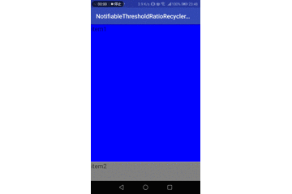

# NotifiableThresholdRatioRecyclerView

This is a custom RecyclerView.  
Notify when display area  becomes smaller or greater than threshold by scrolling.

## How to use 

It is same how to use normal recyclerview.

edit layout.xml 

```
<?xml version="1.0" encoding="utf-8"?>
<android.support.constraint.ConstraintLayout
        xmlns:android="http://schemas.android.com/apk/res/android"
        xmlns:tools="http://schemas.android.com/tools"
        xmlns:app="http://schemas.android.com/apk/res-auto"
        android:layout_width="match_parent"
        android:layout_height="match_parent"
        tools:context=".MainActivity">

    <masahide.com.notifiablethresholdratiorecyclerview.NotifiableThresholdRatioRecyclerView
            android:id="@+id/recyclerView"
            android:layout_width="match_parent"
            android:layout_height="match_parent">

    </masahide.com.notifiablethresholdratiorecyclerview.NotifiableThresholdRatioRecyclerView>

</android.support.constraint.ConstraintLayout>
```

edit Activity

```

import android.os.Bundle
import android.support.v7.app.AppCompatActivity
import android.support.v7.widget.DividerItemDecoration
import android.support.v7.widget.LinearLayoutManager
import kotlinx.android.synthetic.main.activity_main.*

class MainActivity : AppCompatActivity() {

    override fun onCreate(savedInstanceState: Bundle?) {
        super.onCreate(savedInstanceState)
        setContentView(R.layout.activity_main)

        recyclerView.layoutManager = LinearLayoutManager(this, LinearLayoutManager.VERTICAL, false)
        recyclerView.addItemDecoration(DividerItemDecoration(this, LinearLayoutManager(this).orientation))
        recyclerView.adapter = RecyclerAdapter(this, mutableListOf(
            "item1\n\n\n\n\n\n\n\n\n\n\n\n\n\n\n\n\n\n",
            "item2\n\n\n\n\n\n\n\n\n\n\n\n\n\n\n\n\n\n",
            "item3\n\n\n\n\n\n\n\n\n\n\n\n\n\n\n\n\n\n"
        ))
    }
}
```

create Adapter 

```
class RecyclerAdapter(private val mContext: Context, private val dataList: MutableList<String>) : RecyclerView.Adapter<RecyclerAdapter.ViewHolder>() {

    private val mInflater: LayoutInflater = LayoutInflater.from(mContext)

    override fun onCreateViewHolder(viewGroup: ViewGroup, i: Int): ViewHolder {
        return ViewHolder(mInflater.inflate(R.layout.item_row, viewGroup, false))
    }

    override fun onBindViewHolder(viewHolder: ViewHolder, i: Int) {
        viewHolder.textView.text = dataList[i]
    }

    override fun getItemCount(): Int {
        return dataList.count()
    }

    /**
     * please extends NotifiableViewHolder instead ViewHolder
     * this ViewHolder will change background color when display area  becomes smaller or 
     * greater than 0.5f
     */
    inner class ViewHolder(itemView: View) : NotifiableThresholdRatioRecyclerView.NotifiableViewHolder(itemView) {

        /**
         * call this method when display are is greater than notifyDisplayThresholdRatio
         */
        override fun onDisplay() {
            itemView.setBackgroundColor(Color.BLUE)
        }

        /**
         * call this method when display are is less than notifyHideThresholdRatio
         */
        override fun onHide() {
            itemView.setBackgroundColor(Color.GRAY)
        }

        var textView: TextView = itemView.findViewById(R.id.itemRow)

    }
}
```

it's all.




## can change threshold

edit ViewHolder

```
    inner class ViewHolder(itemView: View) : NotifiableThresholdRatioRecyclerView.NotifiableViewHolder(itemView) {

        override fun onDisplay() {
            itemView.setBackgroundColor(Color.BLUE)
        }

        override fun onHide() {
            itemView.setBackgroundColor(Color.GRAY)
        }

        var textView: TextView = itemView.findViewById(R.id.itemRow)
        
        /**
        * change notifyDisplayThresholdRatio , notifyHideThresholdRatio
        */
        init {
            notifyDisplayThresholdRatio = 0.8f
            notifyHideThresholdRatio = 0.2f
        }

    }
```